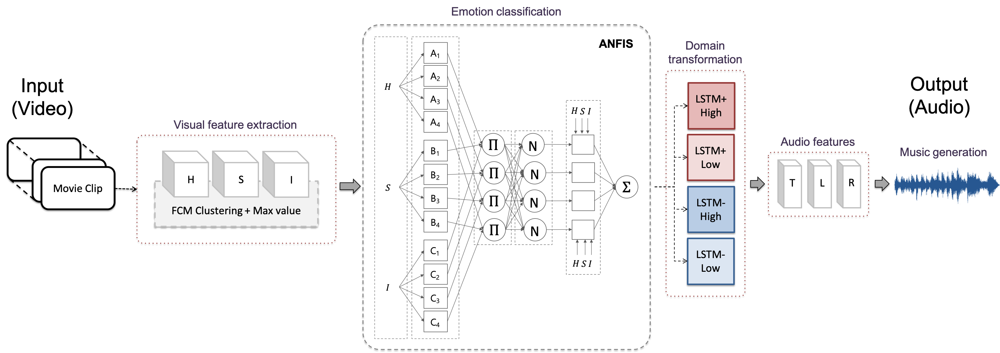

<div align="center"> 

[](https://www.hindawi.com/journals/mpe/2020/8478527/)
[](https://arxiv.org/abs/2004.02113)
[](https://link.springer.com/chapter/10.1007/978-3-319-46672-9_9)
</div>

## About
Repository for paper titled [*"Emotional Video to Audio Transformation Using Deep Recurrent Neural Networks and a Neuro-Fuzzy System"*](https://www.hindawi.com/journals/mpe/2020/8478527/).

  <p align="center">
  
  </p>

### Contents
[Requirements](#requirements) • [Dataset](#dataset) • [How to Use](#how-to-use) • [How to Cite](#acknowledgement) 

## Requirements
Matlab 2017, Mac OS

Toolboxes: Fuzzy Logic, Deep Learning

## Dataset
Both datasets have emotion label in the 2D-axis (Valence and Arousal)

#### [Lindsey Stirling Dataset](https://www.youtube.com/playlist?list=PLg5IYs6I5_xPkTWQ6P_YOiTTh7IBlc7ZH)
* 8 music videos
* Emotion labels: `dataset/lindsey stirling dataset/user_response*.tsv`

#### [DEAP](https://www.eecs.qmul.ac.uk/mmv/datasets/deap/)
* 38 music videos
* Emotion labels: `dataset/deap dataset/participant_ratings.csv`

## Model
* Extract audio and visual features
* ANFIS for emotion classification of visual features
* Seq2Seq for audio feature generation (multi-modal domain transformation)
* Mapping of audio features to audio snippets for music generation

## How to Use
> All the codes are for the Lindsey Stirling Dataset. The codes corresponding to the DEAP Dataset are also available.

0. Change current folder to where this file is located

1. Download datasets

2. Extract audio and visual features
    * Extract sound features:
        ```
        scripts/emotion_from_sound/main_sound2feat_lindsey.m
        ```
    * Extract visual features:
        ```
        scripts/emotion_from_visual/main_video2feat_lindsey.m
        ```

3. Train:
    * Settings and Load data:
        ```
        scripts/model/main_settings.m
        ```
    * ANFIS for emotion classification from HSL (visual features):
        ```
        scripts/model/main_anfis.m
        ```
    * Seq2Seq for domain transformation from visual to audio features:
        ```
        scripts/model/main_seq2seq_train.m
        ```

4. Evaluation (music generation from visual features)
    * Extract sound features (test data):
        ```
        scripts/emotion_from_sound/main_sound2feat_lindsey_test_individual.m
        ```
    * Extract visual features (test data):
        ```
        scripts/emotion_from_visual/main_video2feat_lindsey_test_individual.m
        ```
    * Settings and Load data:
        ```
        scripts/model/main_settings.m
        ```
    * Eval
        ```
        scripts/model/main_anfis_seq2seq_test.m
        ```

5. Evaluation of MTurk results in `scripts/eval_mturk`

## Notes
* Not included due to large size: generated music, video and audio data, and data mats.
* [LSTM for Matlab](https://www.mathworks.com/help/deeplearning/ug/long-short-term-memory-networks.html), https://kr.mathworks.com/help/nnet/ref/nnet.cnn.layer.lstmlayer.html


## Acknowledgement
In case you wish to use this code, please use the following citation:

```
@article{sergio2020mpe,
   AUTHOR={{Sergio, G. C., and Lee, M.}},
   TITLE={Emotional Video to Audio Transformation Using Deep Recurrent Neural Networks and a Neuro-Fuzzy System},
   JOURNAL={Mathematical Problems in Engineering},
   VOLUME={2020},
   PAGES={1--15},
   YEAR={2020},
   DOI={10.1155/2020/8478527},
   ISSN={1024-123X}
}
```

Contact: `gwena.cs@gmail.com`


